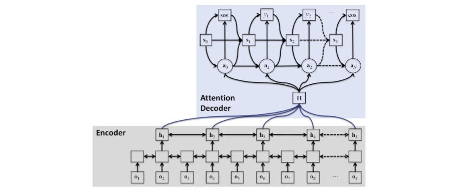

# OpenASR-py

OpenASR-py is a minimal, [PyTorch](https://github.com/pytorch/pytorch) based open source toolkit for end-to-end automatic speech recognition (ASR) related tasks, which borrows many elements from [OpenNMT-py](https://github.com/OpenNMT/OpenNMT-py) and at the same time provides simpler, task-specific reimplementations of several others. 


*Source: https://www.clsp.jhu.edu/workshops/18-workshop/multilingual-end-end-asr-incomplete-data/*

Due to the highly modular and transparent codebase, it can be used as a starting point for research projects in ASR as well as other less explored topics such as domain adaptation, adversarial training, active learning etc.

### Key features
* Blazingly fast, just like OpenNMT-py (details [here](https://github.com/OpenNMT/OpenNMT-py/issues/552#issuecomment-363291799))
* Highly modular and easily extensible codebase
* Provision of basic routine(s) for ASR
* Audio-specific feature extraction and data preprocessing
* Simple and transparent data loading pipeline
* Implementations of a variety of encoders, decoders and attention mechanisms
* Support for word-, character- and wordpiece-level output granularity
* Beam-search decoding and error rate computation during evaluation
* Logging support using Tensorboard
* Model checkpointing and resumable training

## Contents
1. [Installation](#installation)
2. [Overview](#overview)
3. [Pipelines](#pipelines)
4. [Acknowledgements](#acknowledgements)
5. [Contributing](#contributing)

## Installation

We recommend using `conda` for setting up the environment. After it has been successfully installed, follow the steps below:
```bash
# Create environment
conda create -n oasr
conda activate oasr
# Install pytorch 1.1 and its dependencies
# NOTE: This command gives an intermittent 'HTTP 000 Connection Error'. 
# Retrying it, several times at worst, solves the issue.
conda install pytorch cudatoolkit=10.0 -c pytorch
# Clone codebase and install its dependencies
git clone https://github.com/csalt-research/OpenASR-py.git
cd OpenASR-py/
pip install -r requirements.txt
```

## Overview

TODO

## Pipelines

We provide functional code for the following tasks. You can find more details in the corresponding README files.

1. [**Automatic Speech Recognition (ASR)**](pipelines/ASR): obtain the transcription for a given utterance
2. **Domain Adversarial Training (DAT)**: TODO
3. **Active Learning (AL)**: TODO
4. **Active Adversarial Domain Adaptation (AADA)**: TODO

## Acknowledgements
OpenASR-py was originally developed by [Yash Shah](https://ys1998.github.io) ([ys1998](https://github.com/ys1998)); it started off as an initiative to make certain relatively complicated and opaque aspects of OpenNMT-py more ASR-specific and research friendly during his undergraduate thesis project at IIT Bombay under the supervision of Prof. Preethi Jyothi.

## Contributing
Feel free to report any bug, request a feature or ask a general question in the [Issues](https://github.com/csalt-research/OpenASR-py/issues) tab. We also love contributions, for which you can consult the same section for appropriately tagged posts. 